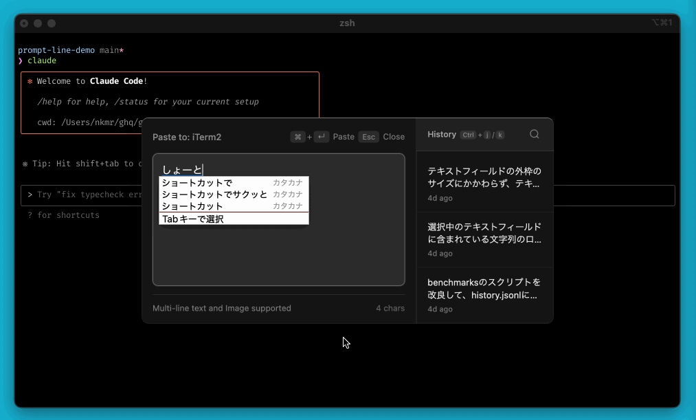
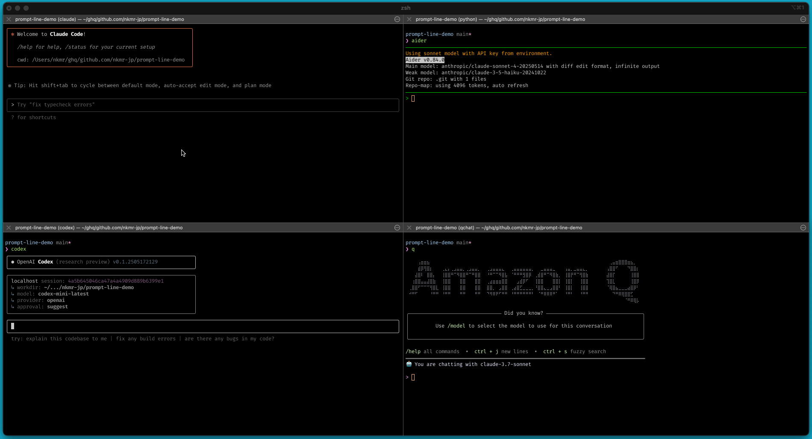
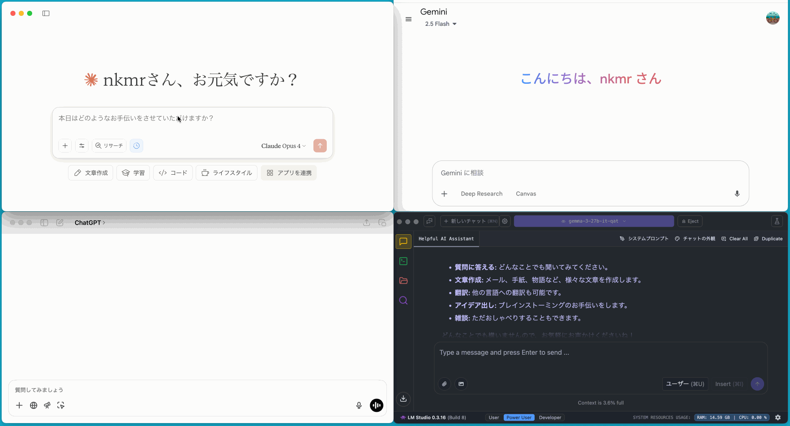
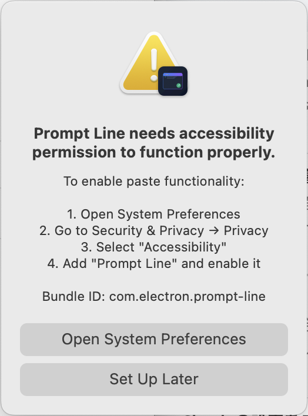
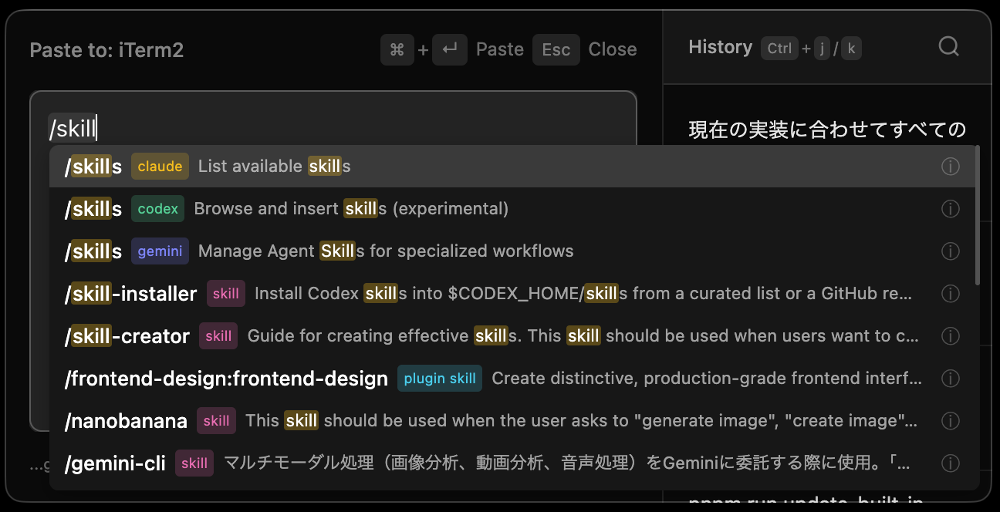
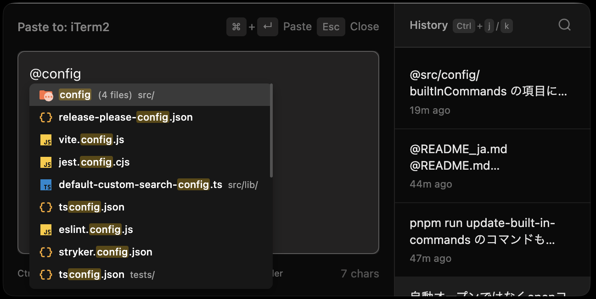
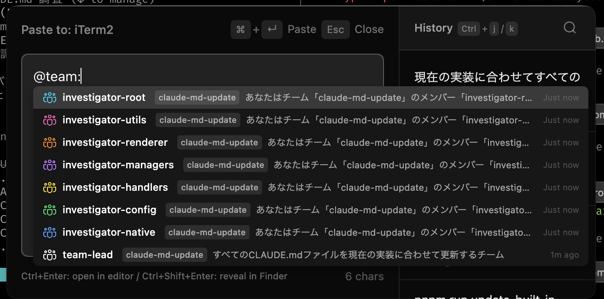
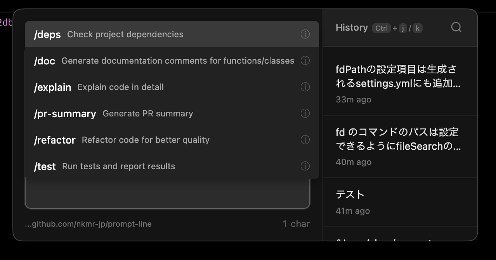
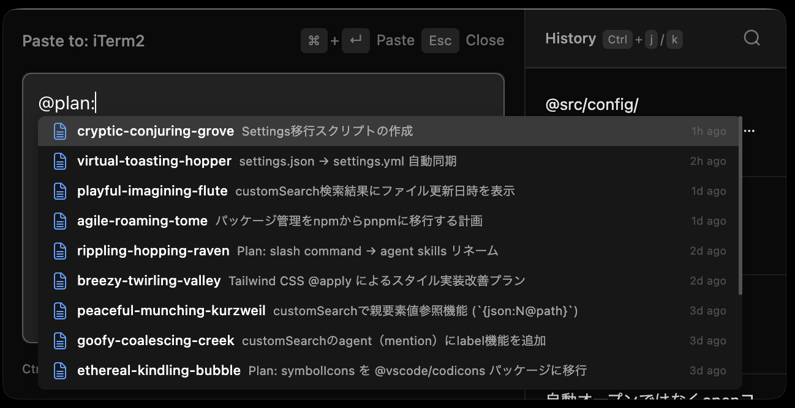
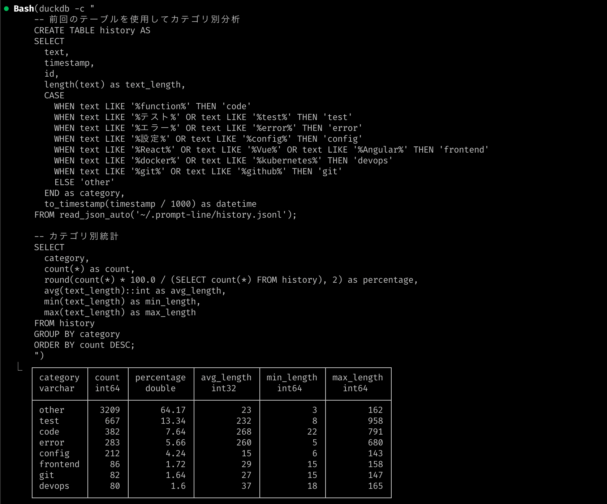

# 🧑‍💻 Prompt Line
[](https://deepwiki.com/nkmr-jp/prompt-line)

[English](README.md) |
日本語

## 概要

Prompt Lineは、[Claude Code](https://github.com/anthropics/claude-code)、[Gemini CLI](https://github.com/google-gemini/gemini-cli)、[OpenAI Codex CLI](https://github.com/openai/codex)、[Aider](https://github.com/paul-gauthier/aider) などのCLI型AIコーディングエージェントのターミナルでのプロンプト入力体験を改善することを目的として開発したmacOSアプリです。
日本語などのマルチバイト文字入力時のUXの課題を専用のフローティング入力インターフェースで解決します。 

特に以下のようなケースでのテキスト入力のストレスを大幅に軽減します。

1. **ターミナルでのCLI型AIコーディングエージェントへのプロンプト入力**
2. **Enterを押したら意図しないタイミングで送信されてしまうチャットアプリ**
3. **入力の重たいテキストエディタ(例：巨大なコンフルエンスのドキュメントなど)**


## 特徴
### サクッと起動、サクッと貼付け
ショートカットでサクッと起動 (`Cmd+Shift+Space`)。<br>
テキスト入力してサクッと貼付け(`Cmd+Enter`)。


### 音声入力したテキストの編集にも最適
操作性は一般的なテキストエディタと同じです。<br>
もちろん音声入力アプリと組み合わせて使うこともできます。<br>
Enterを押しても勝手に送信されないので、改行する場合も気をつける必要はありません。 <br>
音声入力したテキストの編集にも最適です。<br>
(この動画では[superwhisper](https://superwhisper.com/)を使っています。)


### プロンプト履歴を検索して再利用可能
プロンプト履歴は保存されており、右のメニューから再利用可能です。<br>
検索もできます。(`Cmd+f`)


### どこでも起動
テキスト入力フィールドであればどこでも起動できます。<br>
同じプロンプトを他のアプリで再利用したい場合にも便利です。


もちろん、ターミナル以外でも使えます。



## 📦 インストール

### システム要件

- macOS 10.14以降
- Node.js 20以上
- Xcodeコマンドラインツール または Xcode（ネイティブツールのコンパイル用）

### ソースからビルド

1. リポジトリをクローン:
   ```bash
   git clone https://github.com/nkmr-jp/prompt-line.git
   cd prompt-line
   ```

   特定のバージョンをビルドする場合:
   ```bash
   git clone https://github.com/nkmr-jp/prompt-line.git
   cd prompt-line
   git checkout v0.x.x  # 必要なバージョンタグに置き換え
   ```

2. 依存関係をインストール:
   ```bash
   npm install
   ```

3. アプリケーションをビルド:
   ```bash
   npm run build
   ```

4. ビルドされたアプリは `dist/` ディレクトリに作成されます
5. dmgファイルを開く
   ```bash
   open dist/Prompt-Line-0.x.x-arm64.dmg # Apple Silicon
   open dist/Prompt-Line-0.x.x-x64.dmg # Intel
   ```
6. Prompt Line.appをApplicationsフォルダにドラッグ
7. Prompt Lineを起動。システムトレーにアイコンが表示されます。
<div></div>

8. `Cmd+Shift+Space`で使い始められます。

### アクセシビリティ権限

Prompt Lineが他のアプリケーションにテキストを貼り付けるには、アクセシビリティ権限が必要です。<br>
初回使用時にダイアログボックスが表示されるので、指示に従って設定してください。

<div></div>

### トラブルシューティング

#### アクセシビリティ権限のダイアログボックスが表示されない場合

1. **システム設定** → **プライバシーとセキュリティ** → **アクセシビリティ**を開く
2. リストから「Prompt Line」を見つけて有効にする
3. リストにない場合は「+」ボタンでApplicationsからPrompt Lineを追加

#### アクセシビリティ権限で「Prompt Line」が有効になっているのに貼付けできない場合

1. **システム設定** → **プライバシーとセキュリティ** → **アクセシビリティ**を開く
2. 「-」ボタンでApplicationsからPrompt Lineを削除して権限をリセット
3. 再度設定すれば動くようになります。

アクセシビリティ権限のリセットは以下のコマンドでもできます。
```bash
npm run reset-accessibility
```


## 📦 アップデート

既に古いバージョンをインストール済みで、最新版にアップデートする場合は以下の手順を実行してください。

1. `npm run reset-accessibility`のコマンドを実行して「Prompt Line」のアクセシビリティ権限をリセット
2. 「📦 インストール」の項目を参照して、再度インストール


## 使用方法

### 基本的なワークフロー
1. 入力したい場所に移動
2. `Cmd+Shift+Space`を押してPrompt Lineを開く
3. テキストを入力
4. `Cmd+Enter`を押してテキストを貼り付け
5. 作業を継続

### 機能

- **履歴パネル** - 過去のエントリをクリックして再利用。検索も可能。(`Cmd+f`)
- **ドラフト自動保存** - 作業内容を自動的に保存
- **画像サポート** - `Cmd+V`でクリップボード画像を貼り付け
- **ファイルオープン** - ファイルパスのテキストからファイルを起動 (`Ctrl+Enter` or `Cmd+クリック`)
- **ファイル検索** - `@`を入力してファイルを検索 (fdコマンドと設定が必要)
- **シンボル検索** - `@<言語>:<クエリ>`と入力してコードシンボルを検索 (例: `@ts:Config`) (ripgrepが必要)
- **マークダウン検索** - `/`を入力してスラッシュコマンドを検索、または`@`でサブエージェントを検索 (設定が必要)

#### ファイルオープン
ファイルパスや@で検索したファイルを起動して内容を確認できます。(`Ctrl+Enter` or `Cmd+クリック`)



#### ファイル検索
@を入力するとファイルを検索できます。<br>
※ [fd](https://github.com/sharkdp/fd)コマンドのインストールが必要です。( `brew install fd` )<br>
※ `~/.prompt-line/settings.yml` で `fileSearch`の項目を設定する必要があります。 「⚙️ 設定」の項目参照<br>
※ 対応アプリ: Terminal.app, iTerm2, JetBrains IDE（IntelliJ, WebStormなど）, VSCode, Cursor, Windsurf



#### シンボル検索
`@<言語>:<クエリ>`と入力することで、コードシンボル（関数、クラス、型など）を検索できます。<br>
この機能はファイル検索と統合されているため、先にファイル検索を有効にする必要があります。

**必要条件:**
- [ripgrep](https://github.com/BurntSushi/ripgrep) (rg) コマンドのインストールが必要 (`brew install ripgrep`)
- 設定でファイル検索を有効化

**構文:** `@<言語>:<クエリ>`

**例:**
- `@ts:Config` - "Config"を含むTypeScriptシンボルを検索
- `@go:Handler` - "Handler"を含むGoシンボルを検索
- `@py:parse` - "parse"を含むPythonシンボルを検索



#### スラッシュコマンド
`/`を入力するとスラッシュコマンドを検索できます。<br>
AIコーディングアシスタント（Claude Code、OpenAI Codex、Google Gemini）用のビルトインコマンドが利用可能です。<br>
カスタムコマンドは `~/.prompt-line/settings.yml` で追加できます。「⚙️ 設定」の項目参照



`@`を入力するとサブエージェントやスキルを検索することもできます。




## ⚙️ 設定

`~/.prompt-line/settings.yml`に設定ファイルを作成してPrompt Lineの動作をカスタマイズできます：

```yaml
# Prompt Line Settings Configuration
# This file is automatically generated but can be manually edited

# ============================================================================
# KEYBOARD SHORTCUTS
# ============================================================================
# Format: Modifier+Key (e.g., Cmd+Shift+Space, Ctrl+Alt+Space)
# Available modifiers: Cmd, Ctrl, Alt, Shift

shortcuts:
  main: Cmd+Shift+Space           # Show/hide the input window (global)
  paste: Cmd+Enter         # Paste text and close window
  close: Escape              # Close window without pasting
  historyNext: Ctrl+j          # Navigate to next history item
  historyPrev: Ctrl+k          # Navigate to previous history item
  search: Cmd+f            # Enable search mode in history

# ============================================================================
# WINDOW SETTINGS
# ============================================================================
# Position options:
#   - active-text-field: Near focused text field (default, falls back to active-window-center)
#   - active-window-center: Center within active window
#   - cursor: At mouse cursor location
#   - center: Center on primary display

window:
  position: active-text-field
  width: 600                      # Recommended: 400-800 pixels
  height: 300                     # Recommended: 200-400 pixels

# ============================================================================
# FILE OPENER SETTINGS
# ============================================================================
# Configure which applications to use when opening file links
# When defaultEditor is null, system default application is used

fileOpener:
  # Default editor for all files (null = use system default application)
  # Example values: "Visual Studio Code", "Sublime Text", "WebStorm"
  defaultEditor: null
  # Extension-specific applications (overrides defaultEditor)
  #extensions:                       # Extension-specific apps (uncomment to enable)
  #  ts: "WebStorm"
  #  md: "Typora"
  #  pdf: "Preview"

# ============================================================================
# SLASH COMMANDS SETTINGS (/ commands)
# ============================================================================
# Configure slash commands: built-in AI tool commands and custom markdown commands

slashCommands:
  # Built-in commands for AI coding assistants (comment out to disable)
  builtIn:
    #tools:                           # List of tools to enable (all available when omitted)
    #  - claude                       # Claude Code commands
    #  - codex                        # OpenAI Codex commands
    #  - gemini                       # Google Gemini commands

  # Custom slash commands from markdown files
  #custom:
  #  - name: "{basename}"
  #    description: "{frontmatter@description}"
  #    path: ~/.claude/commands
  #    pattern: "*.md"
  #    argumentHint: "{frontmatter@argument-hint}"  # Optional hint after selection
  #    maxSuggestions: 20              # Max number of suggestions (default: 20)
  #    sortOrder: asc                  # Sort order: 'asc' (A→Z) or 'desc' (Z→A)

# ============================================================================
# MENTIONS SETTINGS (@ mentions)
# ============================================================================
# Configure @ mentions: file search, symbol search, and markdown-based mentions
# Note: fd command required for file search (brew install fd)
# Note: ripgrep required for symbol search (brew install ripgrep)

mentions:
  # File search settings (@path/to/file completion)
  #fileSearch:
  #  respectGitignore: true           # Respect .gitignore files
  #  includeHidden: true              # Include hidden files (starting with .)
  #  maxFiles: 5000                   # Maximum files to return
  #  maxDepth: null                   # Directory depth limit (null = unlimited)
  #  maxSuggestions: 50               # Maximum suggestions to show
  #  followSymlinks: false            # Follow symbolic links
  #  #fdPath: null                    # Custom path to fd command

  # Symbol search settings (@ts:Config, @go:Handler)
  symbolSearch:
    maxSymbols: 20000                 # Maximum symbols to return (default: 20000)
    timeout: 5000                     # Search timeout in milliseconds (default: 5000)
    #rgPath: null                     # Custom path to rg command

  # Markdown-based mentions from markdown files
  # Template variables: {basename}, {frontmatter@fieldName}
  # searchPrefix: Search with @<prefix>: (e.g., searchPrefix: "agent" → @agent:)
  # Pattern examples:
  #   "*.md"                  - Root directory only
  #   "**/*.md"               - All subdirectories (recursive)
  #   "**/commands/*.md"      - Any "commands" subdirectory
  #   "**/*/SKILL.md"         - SKILL.md in any subdirectory
  #   "**/{cmd,agent}/*.md"   - Brace expansion (cmd or agent dirs)
  #mdSearch:
  #  - name: "agent-{basename}"
  #    description: "{frontmatter@description}"
  #    path: ~/.claude/agents
  #    pattern: "*.md"
  #    searchPrefix: agent             # Search with @agent:
  #    maxSuggestions: 20
  #    sortOrder: asc                  # Sort order: 'asc' (A→Z) or 'desc' (Z→A)
  #
  #  - name: "{frontmatter@name}"
  #    description: "{frontmatter@description}"
  #    path: ~/.claude/plugins
  #    pattern: "**/*/SKILL.md"
  #    searchPrefix: skill             # Search with @skill:
  #    maxSuggestions: 20
  #
  #  - name: "{basename}"
  #    description: "{frontmatter@title}"
  #    path: /path/to/knowledge-base
  #    pattern: "**/*/*.md"
  #    searchPrefix: kb                # Search with @kb:
  #    maxSuggestions: 100
  #    sortOrder: desc
  #    inputFormat: path               # Insert file path instead of name
```

## プロンプト履歴

- すべてのデータはMac内にローカル保存
- インターネット接続不要
- プロンプト履歴は `~/.prompt-line/history.jsonl` に保存
- JSON Lines形式で保存されているので[DuckDB](https://duckdb.org/)を使って分析することもできます。



## 貢献

詳細は [Contribution Guide](CONTRIBUTING.md) をご確認ください。

## ライセンス

MIT License - 詳細は [LICENSE](./LICENSE) をご確認ください。
