# 🧑‍💻 Prompt Line
[](https://deepwiki.com/nkmr-jp/prompt-line)

[English](README.md) |
日本語

## 概要

Prompt Lineは、[Claude Code](https://github.com/anthropics/claude-code)、[Gemini CLI](https://github.com/google-gemini/gemini-cli)、[OpenAI Codex CLI](https://github.com/openai/codex)、[Aider](https://github.com/paul-gauthier/aider) などのCLI型AIコーディングエージェントのターミナルでのプロンプト入力体験を改善することを目的として開発したmacOSアプリです。
CJK文字(中国語・日本語・韓国語)の入力時のUXの課題を専用のフローティング入力インターフェースで解決します。/や＠によるコンテキスト検索と入力補完の機能も備えています。 

特に以下のようなケースでのテキスト入力のストレスを大幅に軽減します。

1. **ターミナルでのCLI型AIコーディングエージェントへのプロンプト入力**
2. **Enterを押したら意図しないタイミングで送信されてしまうチャットアプリ**
3. **入力の重たいテキストエディタ(例：巨大なコンフルエンスのドキュメントなど)**

## 特徴
### サクッと起動、サクッと貼付け
ショートカットでサクッと起動 (`Cmd+Shift+Space`)。<br>
テキスト入力してサクッと貼付け(`Cmd+Enter`)。
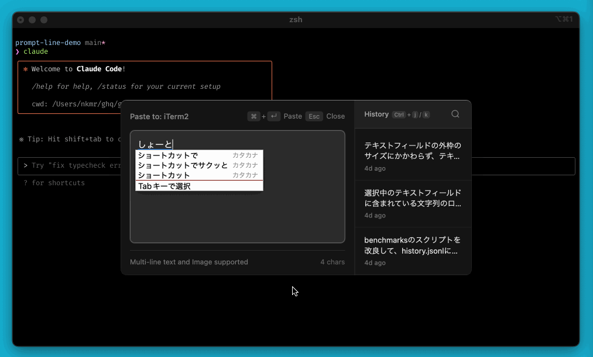

### 音声入力したテキストの編集にも最適
操作性は一般的なテキストエディタと同じです。<br>
もちろん音声入力アプリと組み合わせて使うこともできます。<br>
Enterを押しても勝手に送信されないので、改行する場合も気をつける必要はありません。 <br>
音声入力したテキストの編集にも最適です。<br>
(この動画では[superwhisper](https://superwhisper.com/)を使っています。)
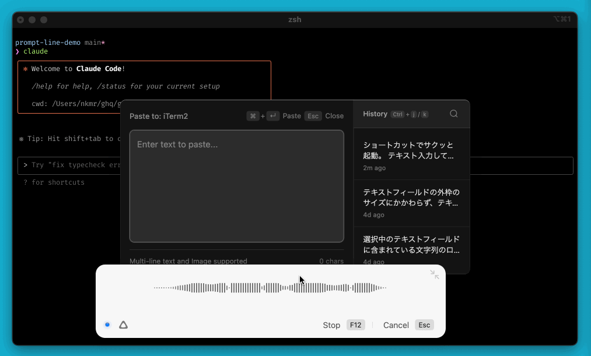

### プロンプト履歴を検索して再利用可能
プロンプト履歴は保存されており、右のメニューから再利用可能です。<br>
検索もできます。(`Cmd+f`)
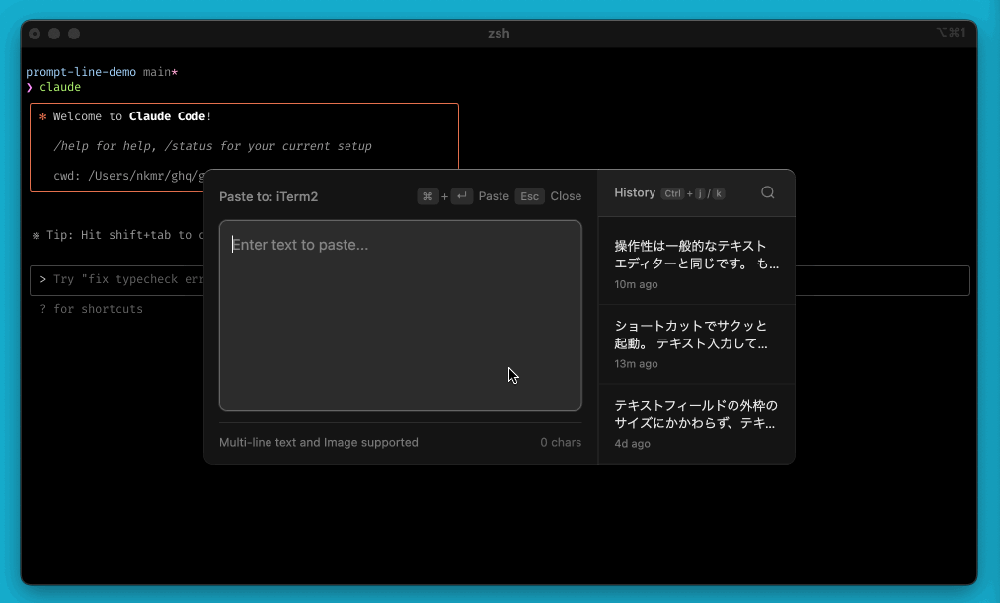

### どこでも起動
テキスト入力フィールドであればどこでも起動できます。<br>
同じプロンプトを他のアプリで再利用したい場合にも便利です。
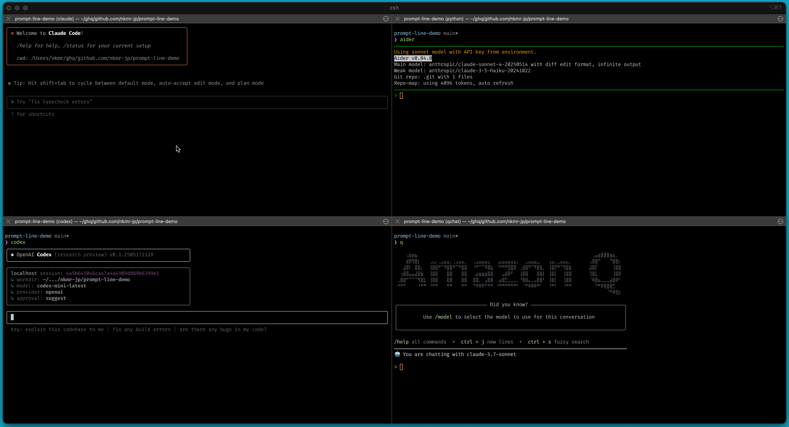

もちろん、ターミナル以外でも使えます。
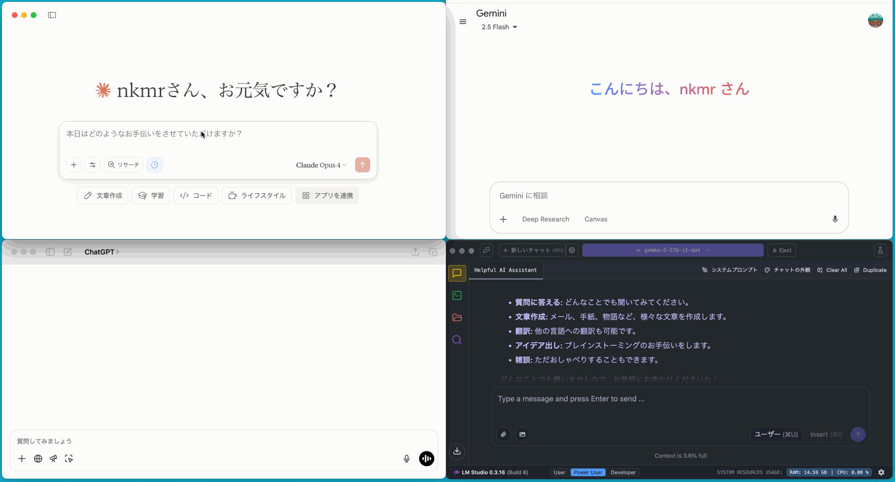

### コンテキスト検索と入力補完

`/`や`@`を入力するとAgent Skills・Agent Built-in・ファイル・シンボルなどのコンテキストを検索して入力補完できます。<br>
これらは設定ファイル(`~/.prompt-line/settings.yaml`)でカスタマイズできます。参考: [settings.example.yaml](settings.example.yaml)
<table>
<tr>
<td>Agent SkillsとAgent Built-in 検索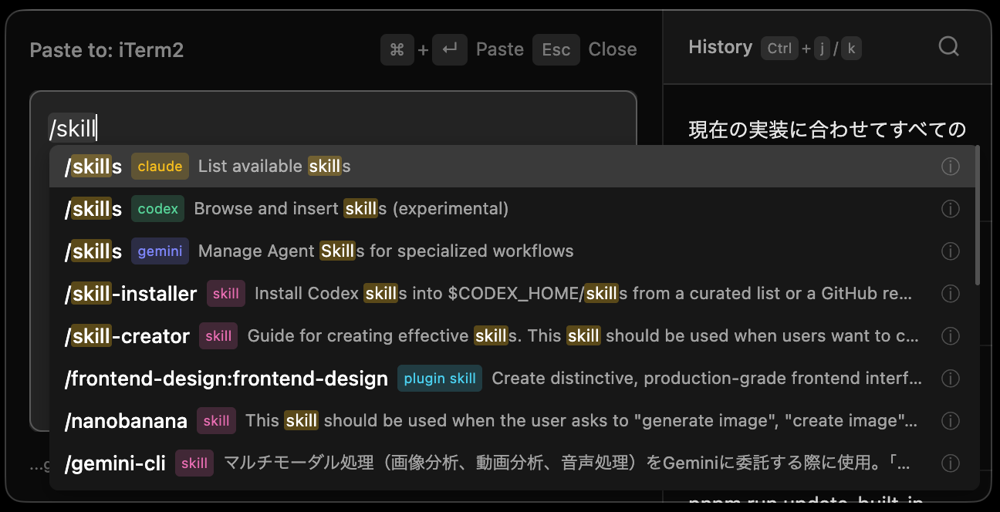 </td>
<td>ファイルとディレクトリ検索 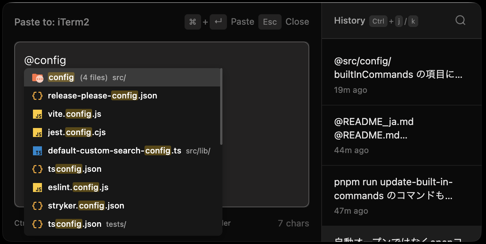 </td>
</tr>
<tr>
<td>シンボル検索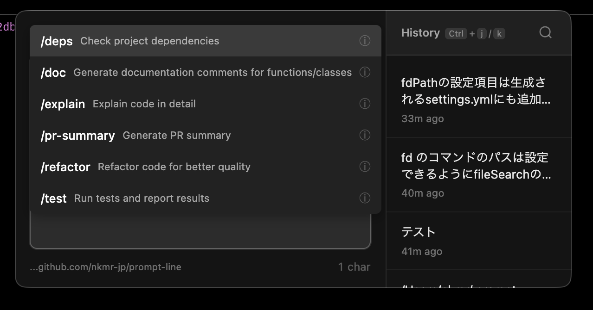 </td>
<td>サブエージェント検索(~/.claude/agents)  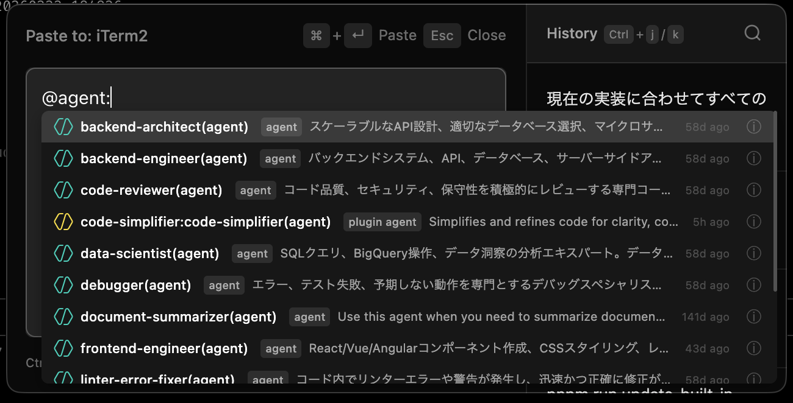 </td>
</tr>
<tr>
<td>プラン検索(~/.claude/plans) 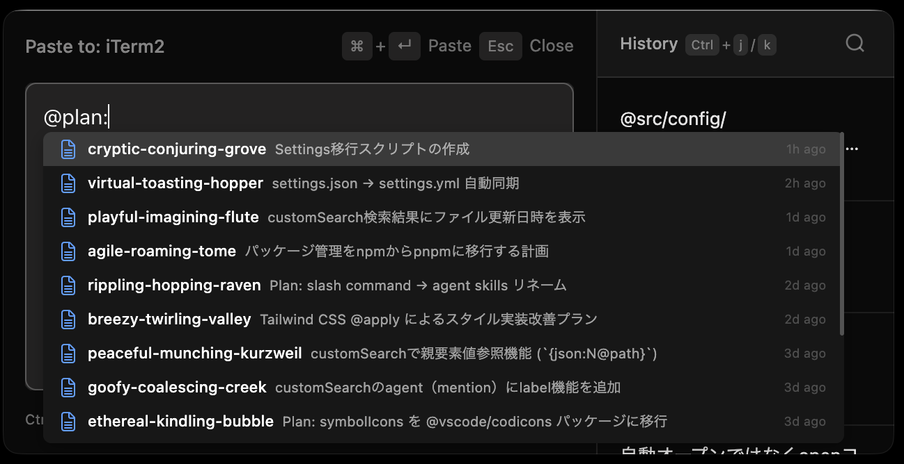 </td>
<td>エージェントチーム検索(~/.claude/teams)  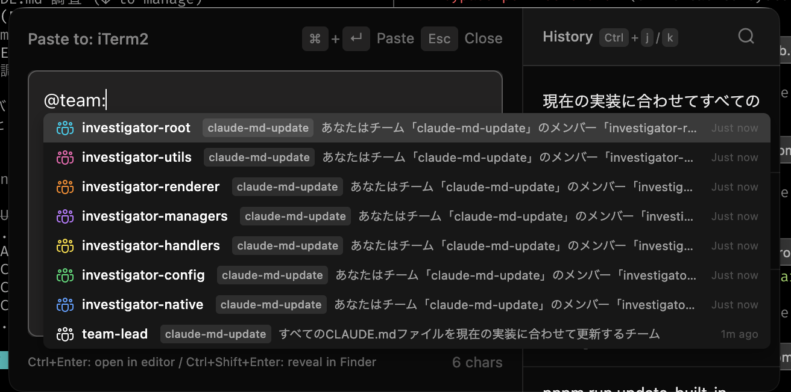 </td>
</tr>
</table>

## 📦 インストール

### システム要件

- macOS 10.14以降
- Node.js 20以上
- [pnpm](https://pnpm.io/installation)
- Xcodeコマンドラインツール または Xcode（ネイティブツールのコンパイル用）
- [fd](https://github.com/sharkdp/fd) と [rg(ripgrep)](https://github.com/BurntSushi/ripgrep)（ファイル検索・シンボル検索機能で使用）

### Prompt Line の インストール

```bash
git clone https://github.com/nkmr-jp/prompt-line.git
cd prompt-line
git checkout v0.x.x  # 任意: 必要なバージョンタグに置き換え
pnpm install
pnpm run setup-codesign # 初回のみ: コード署名証明書をセットアップ
pnpm run install-app    # ビルドして/Applicationsにインストール
```

Prompt Lineを起動。システムトレーにアイコンが表示されます。

<div>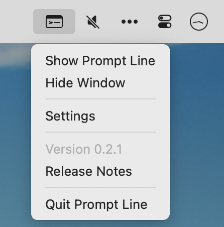</div>

`Cmd+Shift+Space`で使い始められます。

### アクセシビリティ権限

Prompt Lineが他のアプリケーションにテキストを貼り付けるには、アクセシビリティ権限が必要です。<br>
初回使用時にダイアログボックスが表示されるので、指示に従って設定してください。

<div>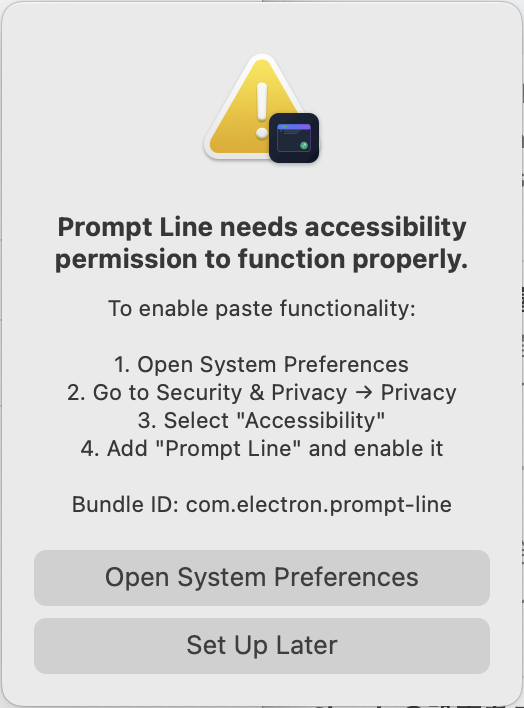</div>

### トラブルシューティング

#### アクセシビリティ権限のダイアログボックスが表示されない場合

1. **システム設定** → **プライバシーとセキュリティ** → **アクセシビリティ**を開く
2. リストから「Prompt Line」を見つけて有効にする
3. リストにない場合は「+」ボタンでApplicationsからPrompt Lineを追加

#### アクセシビリティ権限で「Prompt Line」が有効になっているのに貼付けできない場合

1. **システム設定** → **プライバシーとセキュリティ** → **アクセシビリティ**を開く
2. 「-」ボタンでApplicationsからPrompt Lineを削除して権限をリセット
3. 再度設定すれば動くようになります。

アクセシビリティ権限のリセットは以下のコマンドでもできます。
```bash
pnpm run reset-accessibility
```


## 📦 アップデート

既に古いバージョンをインストール済みで、最新版にアップデートする場合:

```bash
git pull
pnpm install
pnpm run install-app
pnpm run migrate-settings        # 設定ファイルを最新のデフォルトに移行（自動バックアップ）
```

## 使用方法

### 基本的なワークフロー
1. 入力したい場所に移動
2. `Cmd+Shift+Space`を押してPrompt Lineを開く
3. テキストを入力
4. `Cmd+Enter`を押してテキストを貼り付け
5. 作業を継続

### 機能

- **履歴パネル** - 過去のエントリをクリックして再利用。検索も可能。(`Cmd+f`)
- **ドラフト自動保存** - 作業内容を自動的に保存
- **画像サポート** - `Cmd+V`でクリップボード画像を貼り付け
- **ファイルオープン** - ファイルパスのテキストからファイルを起動 (`Ctrl+Enter` or `Cmd+クリック`)
- **ファイル検索** - `@`を入力してファイルを検索
- **シンボル検索** - `@<言語>:<クエリ>`と入力してコードシンボルを検索 (例: `@ts:Config`)
- **カスタム検索** - `/`を入力してSlash CommandsやAgent Skillsを検索、または`@`でサブエージェントを検索

## ⚙️ 設定

`~/.prompt-line/settings.yaml`に設定ファイルを作成してPrompt Lineの動作をカスタマイズできます。

利用可能なすべてのオプションとコメント付きの完全な設定例については、以下を参照してください：
**[settings.example.yaml](settings.example.yaml)**

### 設定項目の概要

| セクション | 説明                                            |
|---------|-----------------------------------------------|
| `shortcuts` | キーボードショートカット（メイン、ペースト、クローズ、履歴ナビゲーション、検索）      |
| `window` | ウィンドウサイズと配置モード                                |
| `fileOpener` | デフォルトエディタ、拡張子別・ディレクトリ別（glob対応）アプリケーション |
| `agentBuiltIn` | Agent Built-inの有効化（claude, codex, gemini等） |
| `agentSkills` | Agent Skills検索機能（`$`などのカスタムトリガーに対応） |
| `customSearch` | `@prefix:`で発動するカスタム検索（キーボードショートカットによる直接起動に対応） |
| `fileSearch` | ファイル検索設定（`@path/to/file`補完） |
| `symbolSearch` | シンボル検索設定（`@ts:Config`、`@go:Handler`） |

## 🔌 プラグイン

プラグインを使うと、GitHubリポジトリでホストされたシンプルなYAMLファイルを書くだけで、Agent Built-in・Agent Skills・Custom Searchエントリを自由にカスタマイズできます。独自のプラグインリポジトリを作成して、自分のワークフローに合わせたPrompt Lineにカスタマイズしましょう。

参考例: [prompt-line-plugins](https://github.com/nkmr-jp/prompt-line-plugins)

### プラグインのインストール

```bash
# prompt-line ディレクトリ内で実行
pnpm run plugin:install github.com/nkmr-jp/prompt-line-plugins

# ブランチやコミットハッシュを指定してインストール
pnpm run plugin:install github.com/nkmr-jp/prompt-line-plugins@develop
pnpm run plugin:install github.com/nkmr-jp/prompt-line-plugins@e5afde2
```

詳細（ソースフォーマット、グローバルCLIセットアップなど）は以下で確認できます:
```bash
pnpm run plugin:help
```

## プロンプト履歴

- すべてのデータはMac内にローカル保存
- インターネット接続不要
- プロンプト履歴は `~/.prompt-line/history.jsonl` に保存
- JSON Lines形式で保存されているので[DuckDB](https://duckdb.org/)を使って分析することもできます。

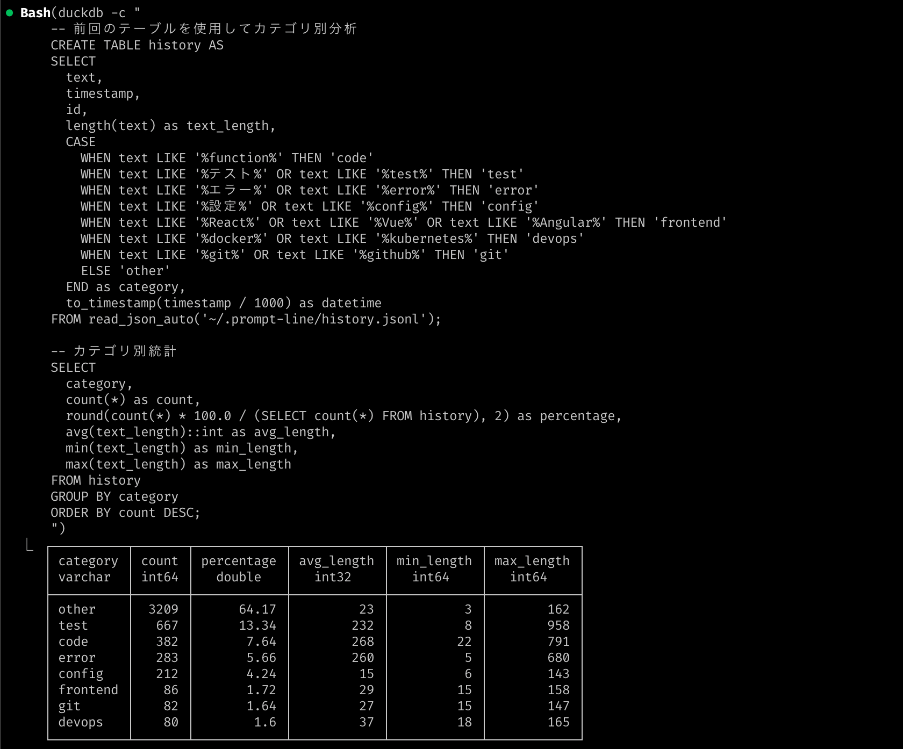

## 貢献

詳細は [Contribution Guide](CONTRIBUTING.md) をご確認ください。

## ライセンス

MIT License - 詳細は [LICENSE](./LICENSE) をご確認ください。
